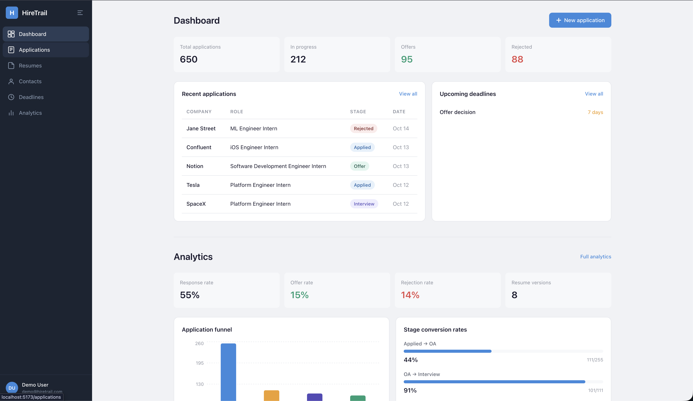

# HireTrail — Internship & Job Application Command Center



## Authors

- **Manav Kaneria** — Applications & Resume Module (Full Stack)
- **Tisha Anil Patel** — Contacts, Deadlines & Analytics Module (Full Stack)

## Class

[CS5610 Web Development — Northeastern University](https://johnguerra.co/classes/webDevelopment_fall_2025/)

## Project Objective

HireTrail is a browser-based job search management platform built for students and early-career professionals. It goes beyond basic application tracking by providing resume versioning with performance analytics, contact relationship management, deadline tracking with urgency alerts, and a data-driven analytics dashboard showing funnel conversion rates — helping candidates make informed decisions about their job search strategy.

## Features

- **Application Tracking** — Full CRUD for job applications with stage tracking (Applied → OA → Interview → Offer → Rejected), timestamped stage history, and resume version tagging.
- **Resume Versioning** — Manage multiple resume versions by name and target role type. See usage counts and response rates per version.
- **Contact Management** — Log recruiters, hiring managers, and referrals per company with LinkedIn links, connection sources, and conversation notes.
- **Deadline Tracker** — Set OA due dates, follow-up reminders, and offer deadlines linked to applications. Color-coded urgency and completion toggles.
- **Analytics Dashboard** — Application funnel chart, stage conversion rates, resume performance breakdown, and weekly application trend visualization.
- **Authentication** — Passport.js with Local (email/password) and Google OAuth strategies.

## Tech Stack

| Layer | Technology |
|---|---|
| Frontend | React 18 (hooks, client-side rendering) |
| Backend | Node.js + Express (ES Modules) |
| Database | MongoDB Atlas (native driver) |
| Auth | Passport.js (Local + Google OAuth) |
| Charts | Recharts |
| Deployment | Render |

## Instructions to Build

### Prerequisites

- Node.js 18+
- MongoDB Atlas account (or local MongoDB)
- (Optional) Google Cloud Console project for OAuth

### Setup

1. **Clone the repository**

```bash
git clone https://github.com/your-username/hiretrail.git
cd hiretrail
```

2. **Backend setup**

```bash
cd backend
npm install
cp .env.example .env
```

Edit `.env` with your MongoDB Atlas connection string and session secret. For Google OAuth, add your client ID and secret (optional — local auth works without it).

3. **Frontend setup**

```bash
cd ../frontend
npm install
```

4. **Run in development**

In one terminal:
```bash
cd backend
npm run dev
```

In another terminal:
```bash
cd frontend
npm run dev
```

The app runs at `http://localhost:5173` with API requests proxied to `http://localhost:5050`.

5. **Build for production**

```bash
cd frontend
npm run build
```

Then start the backend — it serves the built React app:
```bash
cd ../backend
npm start
```

### Seed the Database

Run the seed script to populate 1,000+ synthetic records:

```bash
cd backend
node seed.js
```

## License

[MIT](LICENSE)
